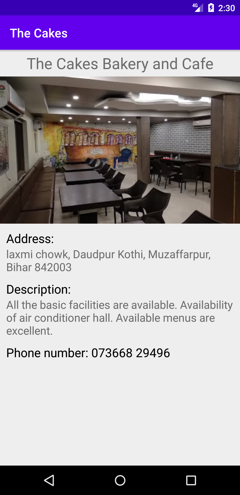

# Single Screen App
The Cake app has been made on Udacity Android Basic Nanodegree course as a #1 project.

# Project Details
Design and implement a single screen app that displays information about a fictional small business.
